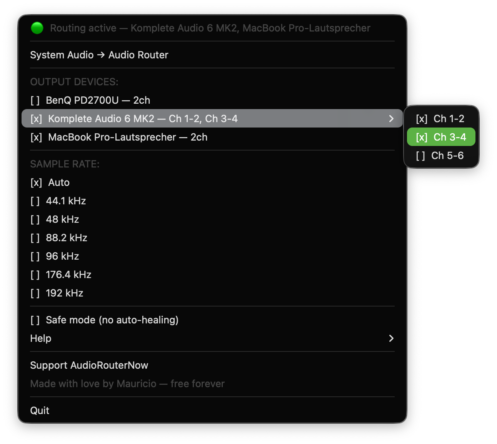

<p align="center">
  
</p>

# AudioRouterNow

**Route macOS system audio to multiple audio interfaces simultaneously.**

AudioRouterNow is a free, open-source macOS menu bar app that lets you send your system audio to any combination of output devices at the same time — no restarts, no Terminal, no external tools required.

> Built by [Mauricio Morkun](https://audiorouternow.mauriciomorkun.com) · Free forever · [Support via ☕](https://www.buymeacoffee.com/mauriciomorkun)



---

## What it does

macOS only routes system audio to one output at a time. AudioRouterNow breaks that limitation:

- Send system audio to **Out 1/2 and Out 3/4 simultaneously** on a multi-output interface
- Route to **multiple interfaces at once** — e.g. a USB interface + AirPods at the same time
- Auto-detects all connected audio interfaces and their channel counts
- Hot-plug: plug in a new interface → it appears in the menu instantly
- Works with USB, Thunderbolt, Bluetooth, HDMI, and internal audio

---

## How it works

AudioRouterNow uses a **custom HAL audio driver** (Apple AudioServerPlugin) — no kernel extension, no security approval, no restart required.

```
macOS System Audio
      │
      ▼
  AudioRouterNow.driver        ← virtual HAL device (no kext, no restart needed)
      │  shared-memory ring buffer (lock-free, ~170 ms max latency)
      ▼
  AudioRouterNowHelper (C)      ← native daemon, reads ring, fans out audio
      │  control: JSON socket ~/.audiorouter/audiorouter.config.sock
      ├──► USB Interface (Komplete Audio 6, Focusrite, ...)
      ├──► HDMI/DisplayPort Monitor (BenQ, LG, ...)
      └──► Built-in Speakers / AirPods

  Menu bar app (Python/rumps) ──── controls ────► Helper socket
```

---

## Features

- **Menu bar interface** — click `🎛️`, check the outputs you want, done
- **Multi-output routing** — any number of devices simultaneously
- **Cross-interface** — route to outputs across different devices at the same time
- **Channel pair selection** — for multi-channel interfaces, choose exactly which output pair to use (Out 1-2, Out 3-4, Out 5-6…) via submenu
- **Hot-plug detection** — devices appear and disappear in real time
- **Remembers your setup** — selected outputs and channel pairs are restored on next launch
- **One-click system audio switch** — switches macOS system output to Audio Router natively (CoreAudio, no AppleScript)
- **No external tools** — no Homebrew, no SwitchAudioSource, no Terminal

---

## Requirements

- macOS 11 (Big Sur) or later
- Apple Silicon (arm64) — Intel Macs are not supported by the prebuilt binary. The entire app must be rebuilt from source (Apple Silicon only).

---

## Installation

1. Download `AudioRouterNow.dmg` from [Releases](../../releases)
2. Open the DMG and drag the app to Applications
3. Launch the app — macOS will ask for your password once to install the audio driver
4. `🎛️` appears in your menu bar — you're done

No Terminal. No restart. No security approval.

---

## What gets installed

AudioRouterNow installs the following components (requires admin password once):

| Component | Location | Purpose |
|-----------|----------|---------|
| HAL Audio Driver | `/Library/Audio/Plug-Ins/HAL/AudioRouterNow.driver` | Virtual audio device |
| Native Helper | Inside driver bundle | Reads audio ring buffer, routes to outputs |
| Configuration | `~/.audiorouter/config.json` | Your saved settings |
| Logs | `~/Library/Logs/AudioRouterNow/` | Troubleshooting |

No LaunchAgent is installed — the menu bar app manages the helper directly.

---

## Usage

1. Click `🎛️` in the menu bar
2. Click **"System Audio → Audio Router"** to make Audio Router the macOS system output
3. Check the output devices you want to route to — routing starts automatically the moment a device is selected
4. Audio now plays through all selected outputs simultaneously
5. Uncheck a device to stop routing to it; check another to add it on the fly

---

## Troubleshooting

**No sound?**
1. Check that "Audio Router" is selected as System Output (System Settings → Sound)
2. Make sure at least one output device is checked in the menu
3. Look for the status indicator at the top of the menu — it shows exactly what's missing

**"Helper not responding" in menu?**
Click the status line to restart the helper. If it persists, quit and relaunch the app.

**Latency / sync issues?**
AudioRouterNow uses a ~170 ms ring buffer for stability. It is not suitable for live monitoring use cases.

**Logs:**
- App log: `~/.audiorouter/logs/audiorouter.log`
- Helper log: `~/Library/Logs/AudioRouterNow/`

---

## Known Issues

- **Monitor hot-plug audio gap**: When a display with built-in audio (e.g. USB-C monitors)
  is connected or disconnected, the system may re-initialize audio routing causing a brief
  (~43ms) gap. This is expected behaviour due to macOS audio device enumeration.
  Fixed in v3.2.0+ with tombstone slot architecture.
- **macOS 14.2+ only for future versions**: The next major version (v4.0) will require
  macOS 14.2+ due to Process Taps API usage.

---

## Uninstall

Use the **Uninstall AudioRouterNow** option in the Help menu for a complete removal.

This removes: HAL driver, helper binary, config files, and logs. You'll need to enter your admin password once.

---

## Coming from BlackHole?

AudioRouterNow was built as a free, open-source alternative:

| | BlackHole | AudioRouterNow |
|---|---|---|
| License | GPL-3.0 | **GPL-3.0** |
| Kernel Extension | Yes | **No** |
| Security approval | Yes, manual | **No** |
| System restart | Yes | **No** |
| External tools | Yes (SwitchAudioSource) | **No** |
| Multiple interfaces | No | **Yes** |
| N-channel routing | No | **Yes** |
| Hot-plug | No | **Yes** |

No kernel extension. No restart. No Homebrew dependencies. Just drag, drop, and route.

---

## Build from source

**Requirements:** Xcode Command Line Tools (`xcode-select --install`), Python 3.10+

```bash
# 1. Build and install the HAL driver
cd driver
make
sudo make install && sudo make reload

# 2. Build the native helper (C daemon)
cd ../helper
make
# Produces ./AudioRouterNowHelper — the menu bar app launches this directly

# 3. Run the Python menu bar app
cd ../engine
python3 -m venv .venv && source .venv/bin/activate
pip install -r requirements.txt
python menu_bar_app.py
```

Build a standalone `.app` + DMG installer:

```bash
cd installer && ./build.sh
# Output: ~/Desktop/AudioRouterNow.dmg
```

> The HAL driver must be built first — run `make` in the `driver/` directory before running `build.sh`.

---

## Project structure

```
AudioRouterNow/
├── driver/                     ← HAL audio driver (C, Universal Binary)
│   └── src/AudioRouterNowDriver.c
├── helper/                     ← Native audio routing daemon (C)
│   ├── AudioRouterNowHelper.c  ← Reads SHM ring, fans out to outputs
│   ├── shared_ring.h           ← Lock-free shared-memory ring buffer
│   ├── Makefile                ← Helper build
│   └── com.audiorouter.now.helper.plist
├── engine/                     ← Python menu bar app
│   ├── menu_bar_app.py         ← Menu bar widget (rumps)
│   ├── helper_client.py        ← Talks to the C helper over JSON socket
│   ├── audio_device_control.py ← CoreAudio device control + system output switch
│   ├── device_manager.py       ← Device discovery + hot-plug
│   ├── config.py               ← Persistent config
│   ├── first_launch.py         ← Auto-installer (no Terminal)
│   └── cli.py                  ← CLI for testing
└── installer/                  ← PyInstaller + DMG build
    ├── build.sh
    └── AudioRouterNow.spec
```

---

## Privacy

AudioRouterNow collects **no data** about you or your system:

- No telemetry, no analytics, no crash reporting
- No network connections of any kind
- Configuration is stored locally in `~/.audiorouter/` — never transmitted
- The app bundle includes OpenSSL libraries as an indirect Python runtime dependency — they are **not used for any network communication**

---

## Support

AudioRouterNow is free and will stay free.  
If it saves you time, you can [buy me a coffee ☕](https://www.buymeacoffee.com/mauriciomorkun) — entirely optional.

---

## Third-party licenses

Bundled open-source components and their licenses: [THIRD_PARTY_NOTICES.md](THIRD_PARTY_NOTICES.md)

---

## License

GPL-3.0 License — see [LICENSE](LICENSE)
